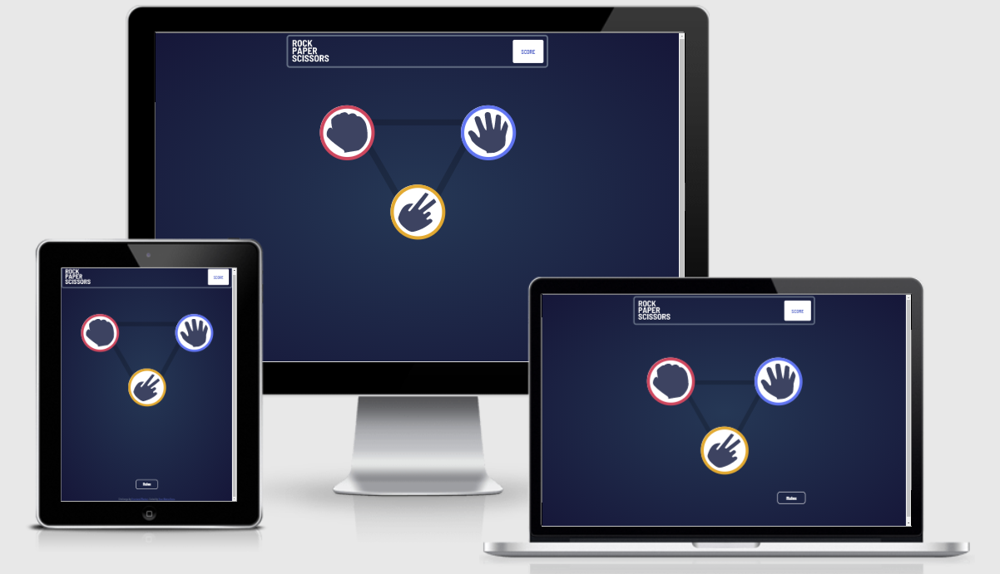

# Frontend Mentor - Rock, Paper, Scissors solution

This is a solution to the [Rock, Paper, Scissors challenge on Frontend Mentor](https://www.frontendmentor.io/challenges/rock-paper-scissors-game-pTgwgvgH). Frontend Mentor challenges help you improve your coding skills by building realistic projects. 

## Table of contents

- [Overview](#overview)
  - [The challenge](#the-challenge)
  - [Screenshot](#screenshot)
  - [Links](#links)
- [My process](#my-process)
  - [Built with](#built-with)
  - [What I learned](#what-i-learned)
- [Author](#author)

**Note: Delete this note and update the table of contents based on what sections you keep.**

## Overview

The challenge is to build a game using HTML,CSS and JS. The game should allow user to pick either rock, paper or scissors and play against the computer. The computer will pick its hand automatically. The score has to represent the overall result of the game
### The challenge

Users should be able to:

- View the optimal layout for the game depending on their device's screen size
- Play Rock, Paper, Scissors against the computer
- Maintain the state of the score after refreshing the browser - implements

### Screenshot

### Links

- Solution URL: [Github](https://github.com/alexeykuz-sys/rock-paper-scissors-game)
- Live Site URL: [Live site](https://rock-paper-scissors-game-git-master-alexeykuz-sys.vercel.app/)

## My process

### Built with

- Semantic HTML5 markup
- CSS custom properties
- Flexbox
- CSS Grid
- Mobile-first workflow

### What I learned
JS:
I learned how to use localstorage

HTML/CSS:
i had an issue with creating of the rock, paper, scissors images and make them responsive.
Initially i tried to build website using Flexbox solely. Grid offered more robust and easier way to ensure page responsiveness and position of the elements.

## Author

- Website - [Alexey Kuzmis](https://github.com/alexeykuz-sys/)
- Frontend Mentor - [@alexeykuz-sys](https://www.frontendmentor.io/profile/alexeykuz-sys)
